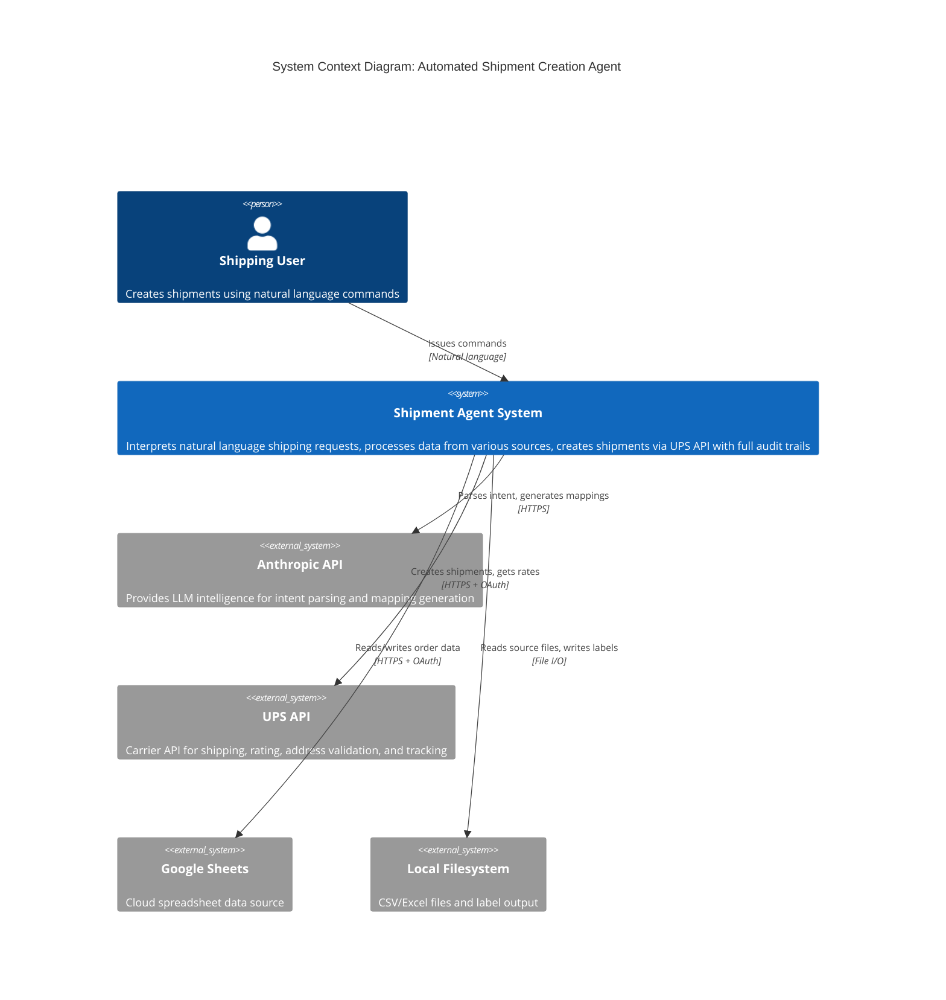
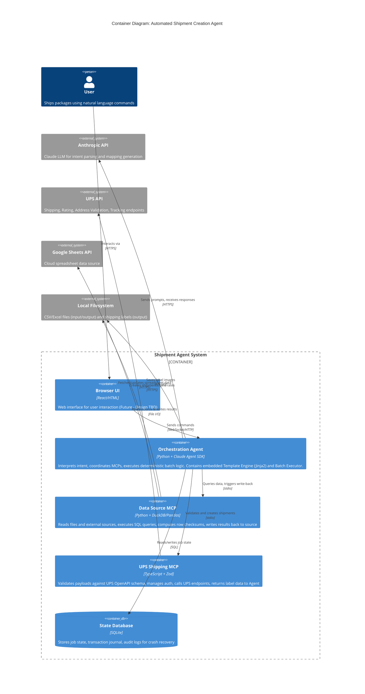
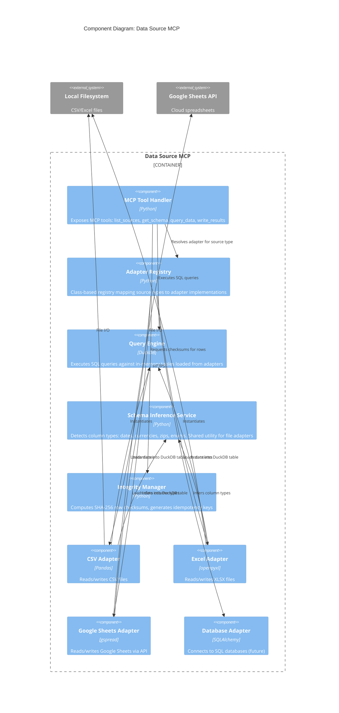
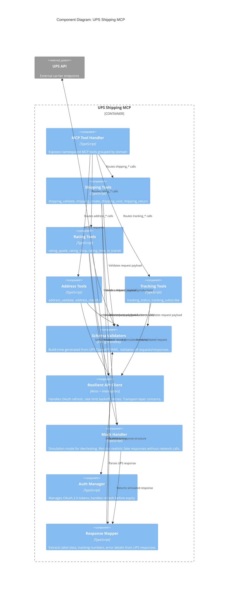
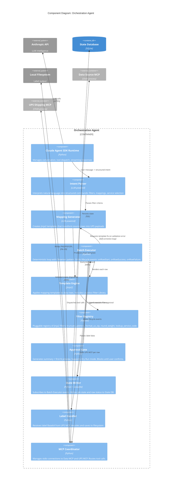
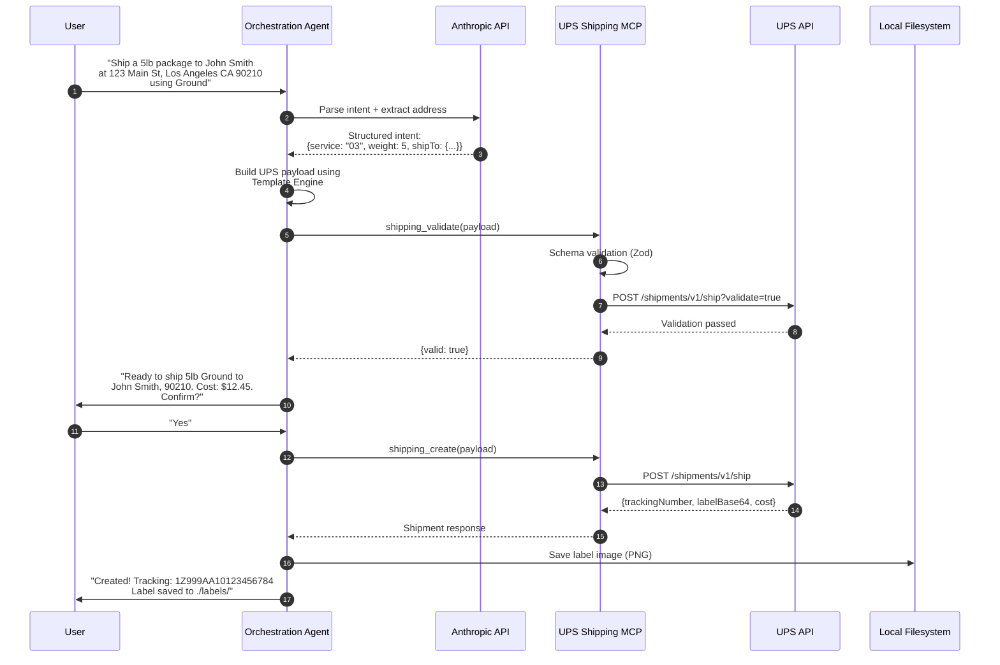
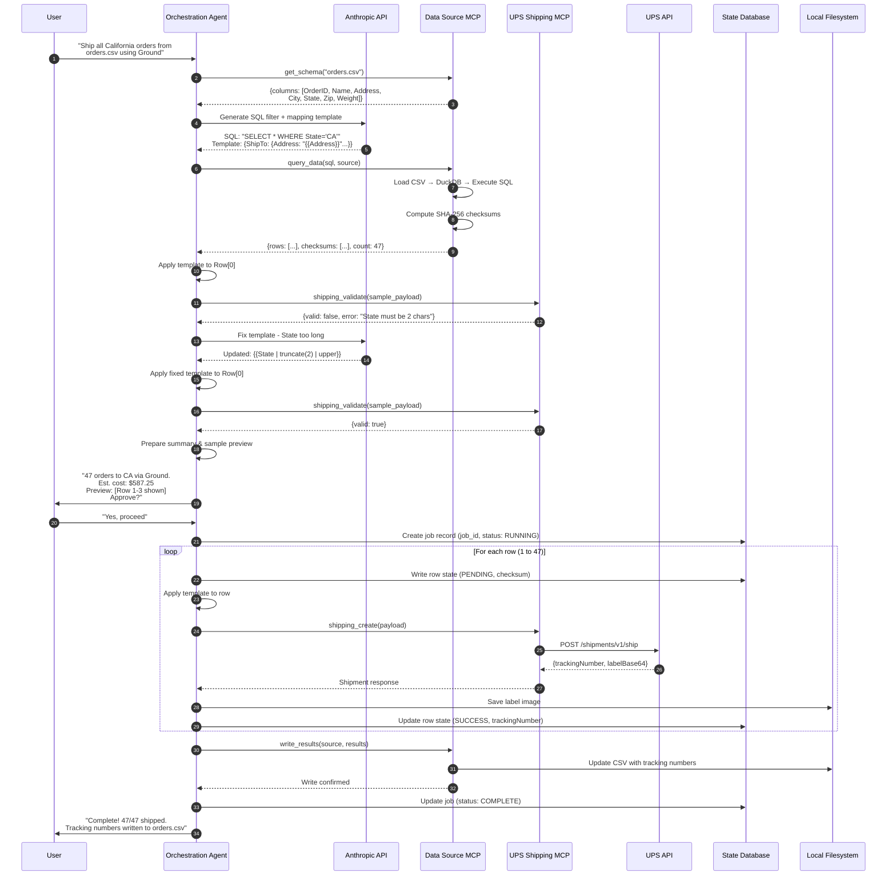

# C4 Architecture Document: Automated Shipment Creation Agent

## 1. System Overview

The Automated Shipment Creation Agent is a natural language interface for batch shipment processing. Users describe what they want to ship in plain English ("Ship all California orders from today's spreadsheet using UPS Ground"), and the system handles everything: parsing intent, extracting data, validating against carrier schemas, and executing shipments with full audit trails.

**Core Design Principle:** The LLM acts as a *Configuration Engine*, not a *Data Pipe*. It interprets user intent and generates transformation rules, but deterministic code executes those rules on actual shipping data. This guarantees zero data loss—the LLM never touches row 42 of your spreadsheet directly.

**Key Capabilities:**
- Natural language commands for shipment creation
- Multiple data source support (CSV, Excel, Google Sheets, databases)
- Full UPS API coverage (shipping, rating, address validation, tracking)
- Deterministic batch execution with per-row audit logging
- Self-correction when validation fails (LLM fixes mapping templates automatically)
- Extensible architecture for future carriers and integrations

**Architecture Style:** The system uses the Model Context Protocol (MCP) to separate concerns into independent servers—one for data access, one for UPS integration—orchestrated by a Claude Agent SDK-powered coordinator.

---

## 2. Level 1: System Context

The context diagram shows the Shipment Agent as a single system and its relationships with users and external systems. This is the "zoomed out" view before we dive into containers.

### 2.1 Context Diagram



### 2.2 External Actors & Systems

| Actor/System | Type | Interaction |
|--------------|------|-------------|
| **Shipping User** | Person | Issues natural language commands like "Ship all orders over $100 via Next Day Air." Reviews previews, approves batches, receives tracking numbers. |
| **Anthropic API** | External System | Provides Claude LLM for parsing user intent into structured queries, generating Jinja2 mapping templates, and self-correcting when validation fails. |
| **UPS API** | External System | The carrier backend. Handles address validation, rate quotes, shipment creation (returns tracking + labels), void/cancel, and tracking status. |
| **Google Sheets** | External System | Optional cloud data source. Users can pull order data from shared spreadsheets and write tracking numbers back. |
| **Local Filesystem** | External System | Primary data source for prototype. Reads CSV/Excel order files, writes shipping label images (PNG/PDF/ZPL). |

### 2.3 What the System Does NOT Do

Clarifying boundaries:

| Out of Scope | Reason |
|--------------|--------|
| **Order Management** | System reads orders from external sources; it doesn't create or manage orders. |
| **Inventory Management** | No stock checking or inventory updates. |
| **Customer Communication** | No direct email/SMS to recipients (though tracking numbers can be exported). |
| **Payment Processing** | Shipping charges go to the configured UPS account; no payment gateway integration. |
| **Multi-Carrier Routing** | MVP is UPS-only. Carrier selection logic is a future enhancement. |

---

## 3. Level 2: Container Diagram

The container diagram shows the major runtime processes and external systems. The core system consists of three processes (Orchestration Agent + two MCP servers) that communicate via stdio, plus a local SQLite database for job state and audit logging.

### 3.1 Container Diagram



### 3.2 Container Descriptions

| Container | Technology | Responsibility |
|-----------|------------|----------------|
| **Browser UI** | React or vanilla HTML/JS | User-facing interface for entering commands, viewing results, approving batches. *Design deferred—will be separate design sessions.* |
| **Orchestration Agent** | Python with Claude Agent SDK, FastAPI | The brain of the system. Receives user input, calls Anthropic API to interpret intent, generates mapping templates, coordinates MCP calls, runs the deterministic batch execution loop. Embeds the Template Engine (Jinja2) and Batch Executor as in-process components. Receives label data from UPS MCP and saves to filesystem. Python chosen to share data structures efficiently with Data MCP and leverage Jinja2's robust templating. |
| **Data Source MCP** | Python with DuckDB, Pandas, openpyxl | "The Librarian." Abstracts heterogeneous data sources behind a SQL interface. Handles file parsing, schema discovery, query execution, row-level checksum computation, and **writing results back to source files** (tracking numbers, status). Owns the integrity of source data. Crashes here don't affect shipping logic. |
| **UPS Shipping MCP** | TypeScript with Zod validators | "The Gatekeeper." Wraps the UPS API with strict schema validation. Every payload is validated against the UPS OpenAPI spec before submission. Manages OAuth token refresh and API error handling. **Returns label data (Base64/URL) to the Agent**—does not write to filesystem directly. TypeScript chosen for superior OpenAPI/Zod type safety ecosystem. |
| **State Database** | SQLite (prototype) → PostgreSQL (production) | Stores job metadata, per-row transaction state (Pending → Sent → Confirmed), checksums, and audit logs. Enables crash recovery and "resume failed batch" capability. |

### 3.3 External Systems

| System | Purpose |
|--------|---------|
| **Anthropic API** | Provides the LLM intelligence. The Agent SDK calls this to parse user intent, generate SQL filters, create mapping templates, and handle self-correction loops. |
| **UPS API** | The carrier API. Endpoints for address validation, rating/quoting, shipment creation, void, tracking. All calls go through the UPS MCP. |
| **Google Sheets API** | Optional cloud data source. The Data MCP can fetch spreadsheet data via this API when users prefer Sheets over local files. |
| **Local Filesystem** | Dual purpose: (1) Source for CSV/Excel input files, (2) Destination for generated shipping label images (PNG/PDF/ZPL). |

### 3.4 Communication Patterns

- **Agent ↔ MCPs**: stdio transport (standard MCP pattern). Each MCP runs as a child process spawned by the Agent. Simple, no network config needed for local dev.
- **Agent ↔ Anthropic**: HTTPS to `api.anthropic.com`. Handled by Claude Agent SDK.
- **Agent ↔ State DB**: Direct SQLite access via `aiosqlite` or `SQLAlchemy`. Upgrades to PostgreSQL connection string for production.
- **Agent ↔ Filesystem**: Agent saves label images received from UPS MCP. Controls output location based on user context.
- **Data MCP ↔ Filesystem**: Bidirectional. Reads source CSV/Excel, writes tracking numbers and status back to source rows after batch completion.
- **Data MCP ↔ Google Sheets**: Bidirectional via Sheets API. Same read/write-back pattern as local files.
- **UPS MCP ↔ UPS API**: HTTPS with OAuth 2.0 bearer tokens. Token refresh handled internally by the MCP. Returns label data (Base64) to Agent—never touches disk.
- **UI ↔ Agent**: WebSocket for streaming responses, HTTP for commands. *Protocol details TBD in UI design sessions.*

### 3.5 Future Enhancements (Not in Prototype)

- **Single-worker runtime policy (current):** ShipAgent is deployed local-first with one backend worker while conversation/session state is process-local.
- **Message Queue (Redis/RabbitMQ)**: For true async batch processing with retry guarantees. Prototype uses in-memory queue within Agent.
- **Distributed State (PostgreSQL)**: For multi-instance deployment. Prototype uses local SQLite.
- **Additional Carrier MCPs**: FedEx, USPS, DHL would follow the same pattern as UPS MCP.

---

## 4. Level 3: Component Diagrams

This section breaks open each container to show its internal components and how they collaborate.

### 4.1 Data Source MCP Components

The Data MCP abstracts heterogeneous data sources behind a unified query interface. It uses a class registry pattern for adapters and centralizes cross-cutting concerns like schema inference and integrity checking.

#### 4.1.1 Component Diagram



#### 4.1.2 Component Descriptions

| Component | Responsibility |
|-----------|----------------|
| **MCP Tool Handler** | Entry point for all MCP tool calls. Routes requests to appropriate components. Implements `list_sources`, `get_schema`, `query_data`, `count_rows`, `write_results`, `get_row_by_checksum`. |
| **Adapter Registry** | Maps source type strings ("csv", "xlsx", "sheets", "postgres") to adapter classes. Simple dictionary lookup: `adapters["csv"] = CSVAdapter`. New adapters register here. |
| **Query Engine** | DuckDB instance that treats loaded data as SQL tables. Adapters load DataFrames into DuckDB; queries run against these tables. Provides consistent SQL semantics regardless of source. |
| **Schema Inference Service** | Shared utility that analyzes column data to detect types. Rules like "5-digit numeric = ZIP", "YYYY-MM-DD pattern = Date". Returns typed schema to help LLM understand data structure. File adapters use this; DB adapter maps SQL types directly. |
| **Integrity Manager** | Computes SHA-256 hash of each row's contents. Hash becomes the row's idempotency key. Used to detect if source data changed between query and execution, and to prevent duplicate processing. |
| **CSV/Excel/Sheets Adapters** | Implement `BaseSourceAdapter` interface: `read() -> DataFrame`, `write_back(results)`, `get_metadata()`. Each handles format-specific parsing and serialization. |
| **Database Adapter** | Future adapter for direct SQL database connections. Bypasses Schema Inference (uses DB's native types) and Query Engine (queries DB directly). |

---

### 4.2 UPS Shipping MCP Components

The UPS MCP wraps the UPS API with strict validation and groups tools by domain for optimal LLM performance. Schemas are generated at build time from UPS OpenAPI specs.

#### 4.2.1 Component Diagram



#### 4.2.2 Component Descriptions

| Component | Responsibility |
|-----------|----------------|
| **MCP Tool Handler** | Entry point for MCP calls. Routes based on tool name prefix (`shipping_*`, `rating_*`, etc.). Returns structured responses to Agent. |
| **Shipping Tools** | Domain group for shipment lifecycle: `shipping_validate` (dry run), `shipping_create` (get label), `shipping_void` (cancel), `shipping_return` (return label). |
| **Rating Tools** | Domain group for quotes: `rating_quote` (single service), `rating_shop` (all services), `rating_time_in_transit` (delivery dates). |
| **Address Tools** | Domain group for address operations: `address_validate` (street-level validation with suggestions), `address_classify` (residential vs commercial). |
| **Tracking Tools** | Domain group for visibility: `tracking_status` (current status + history), `tracking_subscribe` (webhook registration). |
| **Schema Validators** | Zod schemas generated at build time from UPS OpenAPI YAML using `openapi-zod-client`. Catches schema mismatches at compile time. Validates both outbound requests and inbound responses. |
| **Resilient API Client** | Axios instance with interceptors for: (1) injecting OAuth bearer token, (2) catching 429 and implementing exponential backoff, (3) retrying transient failures (5xx). Business logic never sees rate limits. |
| **Mock Handler** | Simulation mode for development and high-volume testing. Returns realistic fake responses (tracking numbers, label Base64, rates) without network calls. Activated via `SIMULATION_MODE=true` config flag. Essential for testing 1000-row batches without hitting UPS. |
| **Auth Manager** | Stores OAuth tokens, tracks expiry, proactively refreshes before expiration. Tokens never leak to other components. |
| **Response Mapper** | Extracts relevant data from verbose UPS responses: tracking number, label image (Base64), estimated cost, error messages. Normalizes into clean objects for Agent consumption. |

#### 4.2.3 Tool Namespace Reference

| Namespace | Tools | UPS API Endpoints |
|-----------|-------|-------------------|
| `shipping_*` | `validate`, `create`, `void`, `return` | `/api/shipments/v1/ship`, `/api/shipments/v1/void` |
| `rating_*` | `quote`, `shop`, `time_in_transit` | `/api/rating/v1/Rate` |
| `address_*` | `validate`, `classify` | `/api/addressvalidation/v1/1`, `/v1/3` |
| `tracking_*` | `status`, `subscribe` | `/api/track/v1/details`, `/api/trackalert/subscribe` |

---

### 4.3 Orchestration Agent Components

The Agent coordinates everything: interprets user intent via LLM, generates mappings, orchestrates MCP calls, and runs the deterministic batch loop with full audit logging.

#### 4.3.1 Component Diagram



#### 4.3.2 Component Descriptions

| Component | Responsibility |
|-----------|----------------|
| **Claude Agent SDK Runtime** | Core SDK loop. Manages conversation state, streams responses, dispatches tool calls. Entry point for all user interaction. |
| **Intent Parser** | LLM-powered component that converts natural language ("Ship all California orders via Ground") into structured intent: filter SQL, service code, special handling flags. |
| **Mapping Generator** | LLM-powered component that creates Jinja2 templates mapping source columns to UPS payload fields. Validated against UPS schema before use. |
| **Batch Executor** | The deterministic heart. Iterates over filtered data rows, applies template, calls UPS MCP. Implements Observer pattern—emits `onRowStart`, `onRowSuccess(tracking_number)`, `onRowFailure(error)` events. On specific schema validation errors (e.g., "String too long", "Invalid state code"), can pause batch and request updated template from Mapping Generator via self-correction loop. Never contains business logic beyond the loop. |
| **Template Engine** | Jinja2 environment configured with Logistics Filter Library. Renders `{"ShipTo": {"Address": "{{ address | truncate_address }}"}}` into valid JSON. Catches template errors before API call. |
| **Filter Registry** | Pluggable dictionary of Jinja2 filters. Ships with standard logistics filters; Agent can register custom filters at runtime for edge cases. |
| **Approval Gate** | Pre-execution checkpoint. Shows: total rows, estimated cost (if rated), first 3 rows fully rendered as preview. Offers "Download Dry Run CSV" for full inspection. Blocks until user confirms or cancels. |
| **State Writer** | Observer that subscribes to Batch Executor events. On each event, writes to State DB: `{job_id, row_checksum, status, tracking_number, error, timestamp}`. Enables crash recovery and audit. |
| **Label Handler** | Receives Base64 label data from UPS MCP responses. Decodes and writes to configured output directory. Supports PNG, PDF, ZPL formats based on label type. |
| **MCP Coordinator** | Spawns and manages child processes for Data MCP and UPS MCP. Routes tool calls over stdio. Handles process lifecycle (start, health check, restart on crash). |

#### 4.3.3 Logistics Filter Library (Standard Filters)

| Filter | Example Usage | Behavior |
|--------|---------------|----------|
| `truncate_address` | `{{ addr \| truncate_address(35) }}` | Truncates to N chars without cutting words. UPS address lines max 35 chars. |
| `format_us_zip` | `{{ zip \| format_us_zip }}` | Normalizes to 5-digit or 9-digit (ZIP+4) format. Pads with leading zeros. |
| `round_weight` | `{{ weight \| round_weight(1) }}` | Rounds to N decimal places. UPS requires max 1 decimal. |
| `convert_weight` | `{{ weight \| convert_weight('g', 'lbs') }}` | Converts weight values between units (g, kg, oz, lbs). Critical for cross-border shipping where source data uses metric. |
| `lookup_service_code` | `{{ "Ground" \| lookup_service_code }}` | Maps friendly names to UPS codes: "Ground" → "03", "Next Day Air" → "01". |
| `split_address_lines` | `{{ addr \| split_address_lines }}` | Splits long address into array of 35-char lines for multi-line fields. |
| `to_ups_date` | `{{ date \| to_ups_date }}` | Converts various date formats to UPS format (YYYYMMDD). |
| `to_ups_phone` | `{{ phone \| to_ups_phone }}` | Strips formatting, ensures 10-digit US or international format. |
| `default_value` | `{{ phone \| default_value('555-555-5555') }}` | Provides a fallback if the source field is null/empty. Essential for required fields like Phone where source data may be incomplete. |

---

## 5. Data Flow Sequences

This section illustrates runtime behavior through sequence diagrams, showing how components interact over time.

### 5.1 Single Shipment Creation

The simplest flow: user describes a shipment conversationally, the LLM extracts structured data, and a single label is created. This demonstrates the core intent-to-execution path without batch complexity.

#### 5.1.1 Sequence Diagram



#### 5.1.2 Flow Description

| Step | Component | Action |
|------|-----------|--------|
| 1-3 | Intent Parsing | User's natural language is sent to Anthropic API, which extracts structured shipping data: recipient address, weight, service type. |
| 4 | Template Engine | Agent builds the UPS JSON payload. For single shipments, this may be direct construction rather than a Jinja2 template. |
| 5-8 | Validation | Payload is validated against UPS schema (Zod) locally, then against UPS API's validate endpoint. No label purchased yet. |
| 9-10 | Approval | Agent presents cost estimate and asks for confirmation. User approves. |
| 11-14 | Execution | Shipment created via UPS API. Label (Base64) returned, decoded, saved to filesystem. |
| 15 | Confirmation | User receives tracking number and label location. |

**Error Handling (not shown):** If validation fails (e.g., invalid ZIP), Agent asks LLM to correct the data or prompts user for clarification. If UPS API returns an error during creation, Agent reports the error and offers retry options.

---

### 5.2 Batch Shipment Processing

The full "Map-Filter-Execute" pattern for processing multiple shipments from a data source. This flow demonstrates schema discovery, LLM-generated mapping, dry-run validation with self-correction, user approval, and the deterministic execution loop with per-row audit logging.

#### 5.2.1 Sequence Diagram



#### 5.2.2 Phase Breakdown

| Phase | Steps | Purpose |
|-------|-------|---------|
| **1. Discovery** | 1-4 | User states intent. Agent fetches source schema, LLM generates SQL filter and Jinja2 mapping template. |
| **2. Data Extraction** | 5-6 | Filtered data loaded into DuckDB, checksums computed for each row. Deterministic—same query always returns same rows. |
| **3. Dry Run + Self-Correction** | 7-14 | Template applied to sample row, validated against UPS. On failure, LLM fixes template. Repeats until valid. **Critical:** Errors caught here, not during batch execution. |
| **4. Approval Gate** | 15-17 | Summary shown: row count, estimated cost, first 3 rows rendered. User must explicitly approve before any labels are purchased. |
| **5. Execution Loop** | 18-26 | Deterministic loop processes each row. **Per-row state writes** to State DB ensure crash recovery. Template already validated—failures here are data issues (invalid address) not template issues. |
| **6. Write-Back** | 27-31 | Tracking numbers written back to source file. Job marked complete. User notified. |

#### 5.2.3 Zero Data Loss Guarantees

| Mechanism | Where in Flow | Guarantee |
|-----------|---------------|-----------|
| **Row Checksums** | Step 6 | SHA-256 hash computed at extraction. If source file changes mid-batch, checksum mismatch detected. |
| **Pre-Loop State Write** | Step 19 | Row marked PENDING before API call. If crash occurs, we know this row needs retry. |
| **Post-Success State Write** | Step 25 | Row marked SUCCESS with tracking number only after UPS confirms. No false positives. |
| **Atomic Write-Back** | Step 28 | Tracking numbers written to source only after all rows processed. *Ideally writes to a new file (e.g., `orders_processed_20260122.csv`) or versioned copy to prevent source corruption. Never overwrite original in place.* |
| **Job-Level Status** | Steps 18, 30 | Job record tracks overall progress. On restart, query "RUNNING" jobs to find incomplete batches. |

**Implementation Note:** While the sequence diagram shows a serial loop for clarity, the actual implementation may process rows in parallel chunks (e.g., 5 concurrent requests) for performance. The **per-row state recording** remains atomic regardless of parallelism—each row's PENDING→SUCCESS transition is independent.

#### 5.2.4 Self-Correction Behavior

The self-correction loop (Steps 7-14) handles these common template errors:

| Error Type | Example | LLM Fix |
|------------|---------|---------|
| String too long | "California" → needs 2 chars | Add `truncate(2)` filter |
| Wrong format | "90210-1234" → needs 5 digits | Add `format_us_zip` filter |
| Missing required field | Phone is null | Add `default_value('000-000-0000')` |
| Unit mismatch | Weight in grams, needs lbs | Add `convert_weight('g', 'lbs')` |

**Sample Set Validation:** The dry-run validation runs against a sample set (e.g., first 5 rows), not just Row 0. This catches data variance—Row 0 might have a short address while Row 3 has a 60-character address that triggers truncation errors. Validating multiple samples increases confidence that the template handles real-world data diversity.

**Max retries:** 3 attempts per validation error type. If template cannot be fixed, Agent reports the specific validation error and asks user for guidance rather than proceeding with bad data.

---

## 6. Technology Decisions

Quick reference for all technology choices. Each decision was made to optimize for **prototype speed** while maintaining a clear **production upgrade path**.

### 6.1 Core Stack

| Component | Technology | Rationale |
|-----------|------------|-----------|
| **Orchestration Agent** | Python 3.11+ | Shares ecosystem with Data MCP (Pandas/DuckDB). Enables efficient data structure passing. Claude Agent SDK has full Python support. |
| **Agent Framework** | Claude Agent SDK | Provides agent loop, tool dispatch, streaming, hooks. Same foundation as Claude Code. |
| **Web Framework** | FastAPI | Async-native, WebSocket support for UI, automatic OpenAPI docs. Pairs well with Agent SDK. |
| **Data Source MCP** | Python 3.11+ | Required for Pandas, DuckDB, openpyxl. Data science ecosystem is Python-native. |
| **UPS Shipping MCP** | TypeScript 5.x | Superior type safety with Zod. OpenAPI tooling (`openapi-zod-client`) is more mature in TS ecosystem. |
| **Template Engine** | Jinja2 | Industry standard for Python. Rich filter system. Embedded in Agent process. |
| **State Database** | SQLite → PostgreSQL | SQLite for prototype (zero config, single file). PostgreSQL for production (concurrent access, proper transactions). |

### 6.2 Data Processing Stack

| Component | Technology | Rationale |
|-----------|------------|-----------|
| **Query Engine** | DuckDB | In-memory SQL on DataFrames. Treats CSV/Excel as SQL tables. Fast, no server needed. |
| **DataFrame Library** | Pandas | Universal data manipulation. Required for DuckDB integration. |
| **Excel Parser** | openpyxl | Read/write XLSX. Handles formulas, formatting preservation on write-back. |
| **CSV Parser** | Python csv / Pandas | Standard library for simple cases, Pandas for complex (encoding, delimiters). |
| **Google Sheets** | gspread + oauth2client | Well-documented, handles OAuth flow. |
| **Checksum Algorithm** | SHA-256 | Industry standard for data integrity. No business value in making configurable. |

### 6.3 UPS Integration Stack

| Component | Technology | Rationale |
|-----------|------------|-----------|
| **Schema Validation** | Zod | Runtime type checking. Schemas generated from OpenAPI at build time. |
| **Schema Generation** | openapi-zod-client | Generates Zod schemas + typed client from UPS OpenAPI YAML. Catches breaking changes at compile time. |
| **HTTP Client** | Axios | Interceptor pattern for auth injection, rate limiting, retries. Well-supported in TS. |
| **OAuth Management** | Custom (in Auth Manager) | UPS OAuth is straightforward. No need for heavy library. |

### 6.4 Infrastructure & Tooling

| Component | Technology | Rationale |
|-----------|------------|-----------|
| **MCP Transport** | stdio | Standard MCP pattern. Simple for local dev—no ports, no network config. |
| **Process Management** | Node child_process / Python subprocess | Agent spawns MCP servers as child processes. Built-in, no dependencies. |
| **Async DB Access** | aiosqlite / asyncpg | Non-blocking DB writes during batch execution. |
| **Configuration** | Environment variables + .env | Simple for prototype. Upgrade to secrets manager (Vault, AWS Secrets) for production. |
| **Logging** | Python logging → structured JSON | Text logs for dev, JSON for production (log aggregation compatible). |

### 6.5 Browser UI (Future)

| Component | Technology | Rationale |
|-----------|------------|-----------|
| **Framework** | React or vanilla HTML/JS | TBD in separate design sessions. React if complex state needed, vanilla if simple. |
| **Agent Communication** | WebSocket | Streaming responses from Agent. Real-time batch progress updates. |
| **Label Rendering** | Native browser (PNG/PDF) or ZPL preview library | Most labels are PNG/PDF (browser-native). ZPL needs specialized renderer. |

### 6.6 Development & Build Tools

| Tool | Purpose |
|------|---------|
| **uv / pip** | Python dependency management. uv for speed if available. |
| **pnpm / npm** | TypeScript dependency management for UPS MCP. |
| **pytest** | Python unit/integration tests. |
| **vitest** | TypeScript unit tests for UPS MCP. |
| **ruff** | Python linting and formatting (replaces black + flake8 + isort). |
| **eslint + prettier** | TypeScript linting and formatting. |
| **pre-commit** | Git hooks for lint/format on commit. |

### 6.7 Decision Log

Key decisions made during architecture design:

| Decision | Choice | Alternatives Considered | Why Not |
|----------|--------|------------------------|---------|
| Agent language | Python | Node.js | Data MCP requires Python ecosystem. Avoids cross-language data marshalling. |
| UPS MCP language | TypeScript | Python | Zod + OpenAPI tooling superior in TS. Schema safety critical for carrier API. |
| Template location | Embedded in Agent | Separate service | No network latency. Atomic error handling. CPU-bound operation doesn't need scaling. |
| MCP hosting | Separate processes | Single bundled process | Fault isolation. Dependency isolation. Security boundaries. |
| State storage | SQLite (local-first, single-worker) | JSON files, Redis | ACID transactions for crash recovery. SQL queries for job lookup. No server needed. |
| Checksum algorithm | SHA-256 | MD5, CRC32 | Industry standard. Consistency across all adapters. No performance concern at row level. |
| Write-back strategy | New file / versioned copy | In-place overwrite | Non-destructive. Source file preserved. Standard ETL practice. |

---

## 7. Extension Points

This section documents the intentional seams in the architecture—places designed for future enhancement without refactoring core components.

### 7.1 Data Source Adapters

**Extension Point:** Adapter Registry in Data Source MCP

**How to Extend:**
1. Create new class inheriting from `BaseSourceAdapter`
2. Implement required methods: `read()`, `write_back()`, `get_metadata()`
3. Register in adapter registry: `adapters.register("salesforce", SalesforceAdapter)`

**Planned Adapters:**

| Adapter | Data Source | Priority | Notes |
|---------|-------------|----------|-------|
| `DatabaseAdapter` | PostgreSQL, MySQL, SQL Server | High | Direct SQL queries, bypasses DuckDB for large datasets |
| `SalesforceAdapter` | Salesforce Objects | Medium | OAuth + SOQL queries |
| `NetSuiteAdapter` | NetSuite ERP | Medium | SuiteTalk API integration |
| `ShopifyAdapter` | Shopify Orders | Medium | REST API, webhook for real-time |
| `APIAdapter` | Generic REST endpoints | Low | Configurable auth, pagination, response mapping |

**Interface Contract:**
```python
class BaseSourceAdapter(ABC):
    @abstractmethod
    def read(self, query: str) -> pd.DataFrame: ...
    
    @abstractmethod
    def write_back(self, results: List[RowResult]) -> WriteBackResult: ...
    
    @abstractmethod
    def get_metadata(self) -> SourceMetadata: ...  # columns, types, row count
```

---

### 7.2 Carrier MCPs

**Extension Point:** New MCP server following UPS MCP pattern

**How to Extend:**
1. Create new MCP server (recommended: TypeScript for schema safety)
2. Generate Zod schemas from carrier's OpenAPI spec
3. Implement namespaced tools: `fedex_shipping_create`, `fedex_rating_quote`, etc.
4. Register MCP in Agent's `mcp_servers` configuration

**Planned Carriers:**

| Carrier | MCP Name | Priority | Complexity |
|---------|----------|----------|------------|
| FedEx | `fedex-shipping-mcp` | High | Similar to UPS, good OpenAPI docs |
| USPS | `usps-shipping-mcp` | Medium | WebTools API, XML-based (older) |
| DHL | `dhl-shipping-mcp` | Medium | Multiple regional APIs |
| Canada Post | `canadapost-mcp` | Low | REST API, good for CA shippers |

**Architecture Impact:** None. Each carrier MCP is independent. Agent's MCP Coordinator routes based on tool prefix. Mapping Generator learns carrier-specific schemas.

---

### 7.3 Template Filters

**Extension Point:** Filter Registry in Orchestration Agent

**How to Extend:**
1. Define filter function: `def my_filter(value, *args) -> str`
2. Register at runtime: `filter_registry.register("my_filter", my_filter)`
3. Use in templates: `{{ field | my_filter(arg1) }}`

**Candidate Filters:**

| Filter | Purpose | When Needed |
|--------|---------|-------------|
| `lookup_country_code` | "United States" → "US" | International shipments |
| `format_ca_postal` | Canadian postal code formatting | Canada shipments |
| `calculate_dim_weight` | L×W×H / divisor → dimensional weight | Large packages |
| `hazmat_class_lookup` | UN number → proper shipping name | Hazmat shipments |
| `currency_convert` | USD ↔ CAD ↔ EUR | International declared values |

**Dynamic Registration:** The LLM can request new filters during self-correction. If a transformation is needed that doesn't exist, Agent can generate and register a simple filter on-the-fly (with user approval for security).

---

### 7.4 Approval Workflows

**Extension Point:** Approval Gate in Orchestration Agent

**Current:** Simple yes/no confirmation with preview.

**Future Extensions:**

| Enhancement | Description | Implementation |
|-------------|-------------|----------------|
| **Cost Threshold** | Auto-approve batches under $X, require approval above | Config flag + conditional in Approval Gate |
| **Row-Level Review** | Flag specific rows for manual review (e.g., high value, hazmat) | Add `requires_review` field to row state |
| **Multi-User Approval** | Require manager sign-off for large batches | Integrate with external auth/workflow system |
| **Scheduled Execution** | Approve now, execute at specified time | Add job scheduler component |

---

### 7.5 Notification & Webhooks

**Extension Point:** New Observer on Batch Executor events

**How to Extend:**
1. Create observer implementing event handlers: `on_job_start`, `on_row_complete`, `on_job_complete`
2. Subscribe to Batch Executor: `batch_executor.subscribe(my_observer)`
3. Observer sends notifications via preferred channel

**Planned Integrations:**

| Channel | Trigger | Payload |
|---------|---------|---------|
| **Slack** | Job complete | Summary: rows processed, success/fail count, total cost |
| **Email** | Job complete or failure | Detailed report with tracking numbers |
| **Webhook** | Per-row or per-job | JSON payload to external system (ERP, OMS) |
| **SMS** | Failure only | Alert for failed batches requiring attention |

**Architecture:** Observers are independent of core logic. Adding Slack notifications doesn't change Batch Executor code—just register a new observer.

---

### 7.6 UI Integration

**Extension Point:** Agent's WebSocket/HTTP interface

**Current:** CLI/programmatic access. Browser UI marked as "Future."

**UI Requirements When Implemented:**

| Feature | Agent Support Needed | Status |
|---------|---------------------|--------|
| Real-time batch progress | WebSocket streaming of row events | Ready (events exist) |
| Interactive approval | HTTP endpoint for approve/reject | Ready (Approval Gate supports) |
| Label preview | Base64 label data in response | Ready (Label Handler provides) |
| Job history | Query State DB for past jobs | Ready (State DB schema supports) |
| Source file browser | List available sources via Data MCP | Ready (`list_sources` tool exists) |

**No Agent Changes Required:** The Agent already emits all necessary events and data. UI is purely a presentation layer consuming existing interfaces.

---

### 7.7 Cloud Deployment

**Extension Point:** Configuration and infrastructure layer

**Prototype → Production Upgrades:**

| Component | Prototype | Production | Migration Path |
|-----------|-----------|------------|----------------|
| **State DB** | SQLite (local file) | PostgreSQL (managed) | Change connection string, schema identical |
| **MCP Transport** | stdio (child processes) | HTTP/SSE (containers) | MCP spec supports both, config change only |
| **Config/Secrets** | .env file | AWS Secrets Manager / Vault | Swap config loader, no code changes |
| **Label Storage** | Local filesystem | S3 / GCS bucket | Swap Label Handler's write destination |
| **Logging** | Console / file | CloudWatch / Datadog | Swap logging handler |

**Containerization Strategy:**
```
┌─────────────────────────────────────────────────────┐
│  Kubernetes / ECS Cluster                           │
│  ┌─────────────┐ ┌─────────────┐ ┌─────────────┐   │
│  │   Agent     │ │  Data MCP   │ │  UPS MCP    │   │
│  │  Container  │ │  Container  │ │  Container  │   │
│  └──────┬──────┘ └──────┬──────┘ └──────┬──────┘   │
│         │    HTTP/SSE   │              │           │
│         └───────────────┴──────────────┘           │
│                         │                          │
│  ┌──────────────────────┴──────────────────────┐   │
│  │           PostgreSQL (RDS/Cloud SQL)        │   │
│  └─────────────────────────────────────────────┘   │
└─────────────────────────────────────────────────────┘
```

---

### 7.8 Extension Checklist

When adding any extension, verify:

| Check | Question |
|-------|----------|
| ☐ **Interface Compliance** | Does it implement the required abstract methods/interface? |
| ☐ **Error Handling** | Does it raise appropriate exceptions that the Agent can handle? |
| ☐ **Logging** | Does it emit structured logs for debugging? |
| ☐ **Testing** | Are there unit tests covering happy path and error cases? |
| ☐ **Documentation** | Is usage documented in code comments and README? |
| ☐ **Security** | Does it handle credentials safely (no hardcoding, no logging secrets)? |
