## System Overview

ShipAgent is the `shipagent` Python package declared in `pyproject.toml`, with an Angular/Nx frontend in `shipagent-frontend/` and a Tauri desktop wrapper in `src-tauri/`. The observed system is a local-first shipping automation runtime: HTTP, CLI, frontend, and desktop adapters collect user intent, uploads, settings, and confirmations; provider-specific model runtimes turn natural-language intent into tool calls; deterministic services import data, compile filters, create previews, confirm execution, call UPS through MCP clients, write labels, update source systems, and preserve audit history.

The central architectural rule visible in code is that model providers are adapters. Shipping behavior lives in shared workflow tools and services: `src/services/conversation_handler.py`, `src/services/conversation_runtime/`, `src/orchestrator/agent/tools/`, `src/services/batch_engine.py`, `src/services/batch_executor.py`, and gateway services. Row-level source data is handled by deterministic data-source and batch services, not sent through provider prompt plumbing.

## Component Inventory

| name | file | responsibility |
| --- | --- | --- |
| Interfaces and Automation | `docs/components/shipagent-interfaces-and-automation.md` | FastAPI routes, middleware, CLI commands, daemon mode, and hot-folder automation adapt user and process inputs into service calls. |
| Conversation Runtime | `docs/components/shipagent-conversation-runtime.md` | Manages per-session agents, provider selection, streaming conversation loops, tool dispatch, interruption, and conversation event persistence. |
| Workflow Tool Registry | `docs/components/shipagent-workflow-tool-registry.md` | Defines canonical workflow tools, provider-neutral tool metadata, provider projections, generated artifacts, and hosted MCP tool binding. |
| Data Source Gateways | `docs/components/shipagent-data-source-gateways.md` | Owns data-source and external-platform MCP clients, file/database imports, schema/query access, platform orders, and source write-back. |
| Shipment Execution | `docs/components/shipagent-shipment-execution.md` | Owns deterministic job creation, preview, confirmation, batch execution, per-row state transitions, label storage, and write-back queueing. |
| Carrier UPS Boundary | `docs/components/shipagent-carrier-ups-boundary.md` | Wraps UPS MCP capabilities, credential-scoped gateway creation, normalized UPS responses, hosted boundary readiness, and carrier-neutral rate adapters. |
| Persistence and Audit | `docs/components/shipagent-persistence-and-audit.md` | Owns database configuration, ORM models, migrations, settings, encrypted provider connections, conversation history, job audit logs, and decision audit ledger. |
| Frontend Workspace | `docs/components/shipagent-frontend-workspace.md` | Angular shell/remotes, shared API/types/state/SSE/Tauri libraries, Native Federation loading, and user workflow UI state. |
| Desktop Sidecar Packaging | `docs/components/shipagent-desktop-sidecar-packaging.md` | Tauri wrapper and packaging scripts that bundle the Angular shell and Python backend sidecar, launch it, and resolve the dynamic API port. |

## Mermaid diagram

```mermaid
flowchart LR
    User[User or automation] -->|write commands, uploads, confirmations| UI[Frontend Workspace]
    User -->|write CLI args and files| IA[Interfaces and Automation]
    Desktop[Desktop Sidecar Packaging] -->|write sidecar process and port| UI
    UI -->|read/write HTTP and SSE| IA
    IA -->|read settings, write sessions/events| CR[Conversation Runtime]
    IA -->|read/write jobs, routes, files| SE[Shipment Execution]
    CR -->|read tool declarations, write tool calls| WTR[Workflow Tool Registry]
    WTR -->|read schema/rows, write source actions| DSG[Data Source Gateways]
    WTR -->|write previews and execution requests| SE
    SE -->|read/write jobs, rows, labels, tasks| PA[Persistence and Audit]
    CR -->|write messages and decision events| PA
    DSG -->|write saved sources and write-back| PA
    SE -->|read credentials, write UPS requests| UPS[Carrier UPS Boundary]
    UPS -->|write normalized responses and errors| SE
    PA -->|read settings and credentials| CR
    PA -->|read settings and credentials| UPS
    WTR -->|write provider exports and hosted tools| Hosted[Hosted/provider surfaces]
```

## Per-component summary

### Interfaces and Automation

- Read variables: HTTP requests under `/api/v1`, `SHIPAGENT_API_KEY`, `ALLOWED_ORIGINS`, `SHIPAGENT_CONFIG_PATH`, CLI flags, config files, upload paths, active gateway health, frontend build directory.
- Write variables: FastAPI responses/SSE frames, route-created service calls, PID files, watchdog `.processing`/`processed`/`failed` files, background batch tasks, CLI output.
- Conditional loops: FastAPI lifespan startup/shutdown, API-key and CORS gates, sliding-window rate limiting, request-size enforcement, CLI `--standalone` versus daemon clients, watchdog debounce/backlog processing and auto-confirm checks.

### Conversation Runtime

- Read variables: session state, user messages, data-source metadata, column samples, MRU contacts, prior conversation messages, `SHIPAGENT_AGENT_RUNTIME`, settings `agent_model`, provider API keys.
- Write variables: active `AgentSession` objects, provider input history, streamed `agent_message` and artifact events, conversation messages, decision audit runs/events, provider tool results.
- Conditional loops: session lock and turn generation guards, agent rebuild on source/contact/mode hash changes, runtime selection for fake/OpenAI/Gemini/Claude, provider turn loop up to `max_turns`, per-tool dispatch loop, interrupt/cancel handling.

### Workflow Tool Registry

- Read variables: tool definitions from `src/orchestrator/agent/tools/`, interactive mode, canonical `ToolContract` metadata, provider export targets, bridge callbacks.
- Write variables: SDK MCP tool definitions, provider declarations, runtime `WorkflowToolDefinition` metadata, generated JSON artifacts, hosted FastMCP tools, provider descriptor output.
- Conditional loops: batch-only versus interactive-only exposure, side-effect and confirmation classification, export filtering per provider, registry validation of schemas and public side-effect policy, artifact generation loops across OpenAI/Microsoft/Gemini/MCP exports.

### Data Source Gateways

- Read variables: import file paths, database connection strings and queries, platform credentials, active DuckDB source state, SQL filter parameters, `SHIPAGENT_ALLOWED_PATHS`, external platform order filters.
- Write variables: in-memory DuckDB `imported_data`, source metadata, saved data-source rows, mapping-cache invalidation, platform connection context, local file/database/platform write-back updates.
- Conditional loops: process-global gateway singleton locks, MCP reconnect-on-transport failure, import router by format/source type, SQL AST validation and limit enforcement, batch write-back iteration, external platform client selection.

### Shipment Execution

- Read variables: compiled filters, fetched rows, `Job`/`JobRow` state, `order_data`, shipper settings, UPS credentials, concurrency settings, preview hash, confirmation payloads, active data source.
- Write variables: jobs, rows, preview hashes, row statuses, tracking numbers, costs, duties/taxes, staged/final labels, write-back tasks, progress events, final job status.
- Conditional loops: preview row rating with bounded concurrency and preview caps, confirm-time preview/hash/CAS guards, execute row semaphore loop, two-phase `pending -> in_flight -> completed/failed/needs_review` state machine, write-back local/external routing, startup recovery loops.

### Carrier UPS Boundary

- Read variables: UPS credentials, UPS account/environment, request bodies, UPS MCP tool names, `shipagent_capabilities`, raw UPS MCP responses, hosted boundary declarations.
- Write variables: stdio MCP calls, normalized rate/shipment/tracking/pickup/landed-cost responses, translated `UPSServiceError` values, readiness reports, carrier-neutral `RateResult`.
- Conditional loops: read-only versus mutating retry policy, reconnect serialization, response normalization branches, boundary contract checks for required tools/capabilities/response formats, workflow wrappers preventing raw provider-neutral UPS mutations.

### Persistence and Audit

- Read variables: `DATABASE_URL`, `SHIPAGENT_DB_PATH`, SQLAlchemy sessions, ORM rows, encryption keys/keyring values, settings patches, connection credentials, audit query filters.
- Write variables: SQLite/Postgres rows for jobs, rows, conversations, provider connections, settings, contacts, commands, saved sources, write-back tasks, hosted records, audit logs, decision ledger JSONL mirror.
- Conditional loops: SQLite pragma configuration, startup migrations and column backfills, redaction traversal, settings singleton creation, credential validation/encryption branches, audit retention cleanup, decision-event hash chaining.

### Frontend Workspace

- Read variables: `API_BASE_URL`, backend DTOs in shared types, Native Federation manifests, browser `EventSource`, Tauri globals, shared stores, route state, file inputs.
- Write variables: HTTP requests, upload `FormData`, conversation/job SSE subscriptions, NgRx SignalStore state, UI artifacts, confirmation payloads, sidecar API base URL.
- Conditional loops: Tauri sidecar port versus dev/prod API fallback, lazy remote loading, per-component SSE lifecycle, stream event parsing and ping skipping, store methods around loading/error states, route/remote composition.

### Desktop Sidecar Packaging

- Read variables: Tauri resource directory, `backend-dist/shipagent-core`, sidecar stdout events, `tauri.conf.json`, Angular dist output, PyInstaller spec, updater key placeholder, smoke-test health endpoint.
- Write variables: backend child process handle, `window.__SHIPAGENT_PORT__` via frontend resolver, packaged app bundles, `dist/shipagent-core`, smoke stdout files, Tauri updater/app artifacts.
- Conditional loops: sidecar stdout read loop with timeout, early-exit/error handling, build script frontend/backend/smoke phases, dynamic resource path validation, packaging targets for app/dmg.
