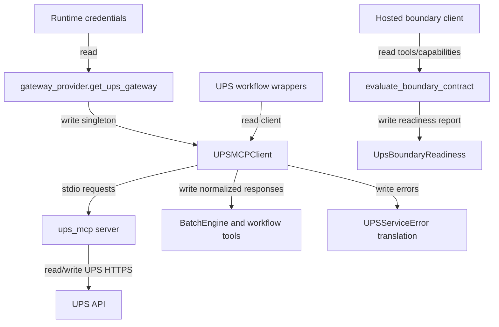

## Responsibility

The Carrier UPS Boundary component isolates UPS-specific transport, normalization, and readiness checks from business workflow code. `src/services/ups_mcp_client.py` spawns the installed `ups_mcp` server over stdio with UPS credentials, classifies retryable errors, separates read-only and mutating tools, normalizes UPS rate/shipment/tracking/pickup/landed-cost responses, and translates MCP tool failures into `UPSServiceError`. Workflow-visible UPS operations are wrappers in `src/orchestrator/agent/tools/ups.py`, `pickup.py`, `tracking.py`, and `documents.py`; deterministic batch execution calls `UPSMCPClient` directly through `BatchEngine`.

`src/services/gateway_provider.py` creates a process-global UPS gateway using credentials resolved by `src/services/runtime_credentials.py`. `src/carriers/ups_gateway.py` exposes a carrier-neutral `UPSCarrierGateway.rate()` around the UPS client. Hosted readiness code in `src/hosted/ups_boundary/` evaluates required UPS MCP tools, declared ShipAgent capabilities, response formats, validators, and readiness status without invoking mutating operations.

Evidence: `tests/services/test_ups_mcp_client.py`, `tests/services/test_runtime_credentials.py`, `tests/orchestrator/agent/test_tools_v2.py`, `tests/carriers/test_ups_gateway.py`, and `tests/hosted/ups_boundary/test_contract.py`.

## Read Variables

- UPS OAuth client ID, client secret, environment, account number, UPS specs directory, and process `PATH`.
- UPS request bodies for rate, shipment creation, void, address validation, time in transit, pickup, tracking, paperless document, locator, and landed-cost tools.
- MCP tool names, `shipagent_capabilities`, raw MCP tool result content, raw UPS responses, and MCP transport/session state.
- Runtime credential records and settings/env fallback values.
- Hosted boundary declarations: contract version, server version, capabilities, response formats, and available tools.

## Write Variables

- MCP stdio server parameters and UPS MCP tool calls.
- Normalized response dictionaries: rate totals, rated shipments, tracking numbers, label data, charge breakdowns, shipment IDs, address candidates, pickup/location/tracking/landed-cost payloads.
- `UPSServiceError` values with translated codes/messages and retry classification.
- UPS gateway singleton state, reconnect count, connection generation, retry-attempt counters, and health/readiness results.
- Hosted `UpsBoundaryCapabilityReport`, `UpsBoundaryReadiness`, validation results, missing tools/capabilities/formats, and carrier-neutral `RateResult`.

## Conditional Loops

- UPSMCPClient retries read-only tools on transient patterns but mutating tools use no automatic retries to avoid duplicate side effects.
- Connection lifecycle serializes reconnect/disconnect while allowing concurrent tool calls; transport failures trigger reconnect classification.
- Response normalization branches over UPS nested and flat response shapes, rate versus shop modes, missing tracking numbers, label data lists, charge formats, and error envelopes.
- Hosted boundary evaluation infers capabilities from available tools, merges declared capabilities, checks `hosted-v1`, and fails closed when required metadata or response formats are absent.
- Workflow wrappers validate required arguments before calling UPS and return sanitized error envelopes for provider/runtime consumption.

## Mermaid (internal flow)

