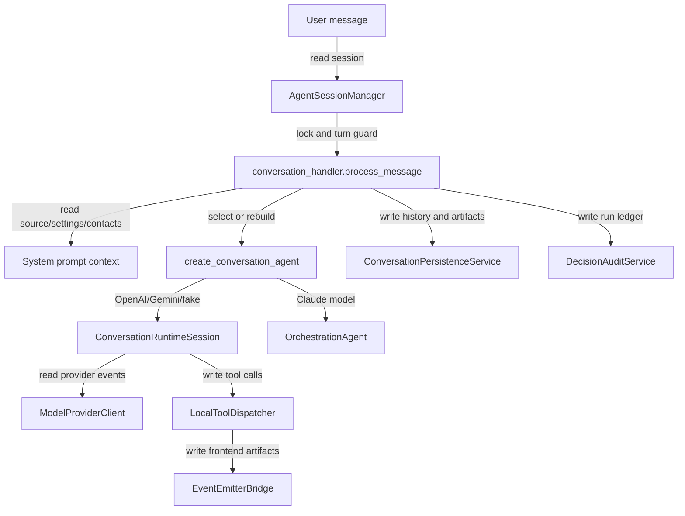

## Responsibility

The Conversation Runtime component owns user-message execution across provider runtimes. `src/services/agent_session_manager.py` tracks process-local `AgentSession` instances with per-session locks, active agents, turn generation guards, mode flags, prewarm/message tasks, and idle reaping. `src/services/conversation_handler.py` is the canonical message path used by HTTP routes and the CLI runner: it resolves current data-source context, starts decision audit runs, rebuilds agents when context changes, streams model/tool events, persists assistant text and artifacts, and completes audit state.

`src/services/conversation_agent.py` selects a provider behind the `ConversationAgent` protocol. OpenAI/Gemini/fake providers use `src/services/conversation_runtime/runtime_session.py`; Claude-style models use `src/orchestrator/agent/client.py`. The neutral runtime loops over provider stream events, builds a `WorkflowToolCatalog`, dispatches local tools through `LocalToolDispatcher`, and projects safe tool results back to the provider. The Claude adapter mounts in-process orchestrator tools through the Claude Agent SDK, hooks from `src/orchestrator/agent/hooks.py`, and optional UPS MCP access for compatibility.

Evidence: `tests/services/test_conversation_agent.py`, `tests/services/test_conversation_handler.py`, `tests/services/test_conversation_handler_resume.py`, `tests/services/test_agent_session_manager.py`, `tests/services/conversation_runtime/test_runtime_session.py`, `tests/services/conversation_runtime/test_dispatcher.py`, `tests/orchestrator/agent/test_client.py`, and API conversation tests.

## Read Variables

- User message content, conversation session IDs, interactive/batch mode flags, in-memory `AgentSession` fields, prior conversation records, and current turn generation.
- Current data-source info and column samples from `get_data_gateway()`, plus source signatures, row counts, column names, and schema fingerprints.
- MRU contacts from `ContactService`, settings `agent_model` from `SettingsService`, and runtime/provider environment variables such as `SHIPAGENT_AGENT_RUNTIME`, `OPENAI_API_KEY`, and `GEMINI_API_KEY`.
- Provider stream events, provider result metadata, provider tool calls, and tool result metadata.
- Attachment/artifact events, decision audit context variables, and `AGENT_HIDE_TRANSIENT_CHAT`.

## Write Variables

- In-memory session state: `session.agent`, `agent_source_hash`, `interactive_shipping`, `confirmed_resolutions`, turn generations, prewarm tasks, and message task sets.
- `ConversationRuntimeSession` provider history, active generation, interrupt markers, last result metadata, and event bridge callbacks.
- Streamed event dictionaries: `agent_message_delta`, `agent_message`, `tool_call`, artifacts such as `preview_ready`, `pickup_result`, `tracking_result`, `paperless_result`, and terminal/error events.
- Persistent assistant messages and system artifact messages through `ConversationPersistenceService`.
- Decision audit runs/events and job IDs through `DecisionAuditService`.
- Provider tool result messages with sanitized content and structured payload summaries.

## Conditional Loops

- `ensure_agent()` rebuilds an agent when source hash, interactive mode, or prompt contacts change; otherwise it reuses the existing runtime.
- Runtime selection branches to fake, OpenAI, Gemini, Claude SDK, mismatch errors, or unavailable-agent responses based on `SHIPAGENT_AGENT_RUNTIME` and model prefixes.
- `process_message()` serializes each session with an async lock, cancels inactive turn generations, switches interactive sessions to batch mode when needed, and hides transient chat text when artifacts are emitted.
- `ConversationRuntimeSession` loops up to `max_turns`, streaming provider text, collecting provider output items and tool calls, de-duplicating tool call IDs, executing local tools, appending tool result messages, and stopping when no tool calls remain.
- Interrupt handling marks active generations interrupted and calls provider cancellation when supported.

## Mermaid (internal flow)

