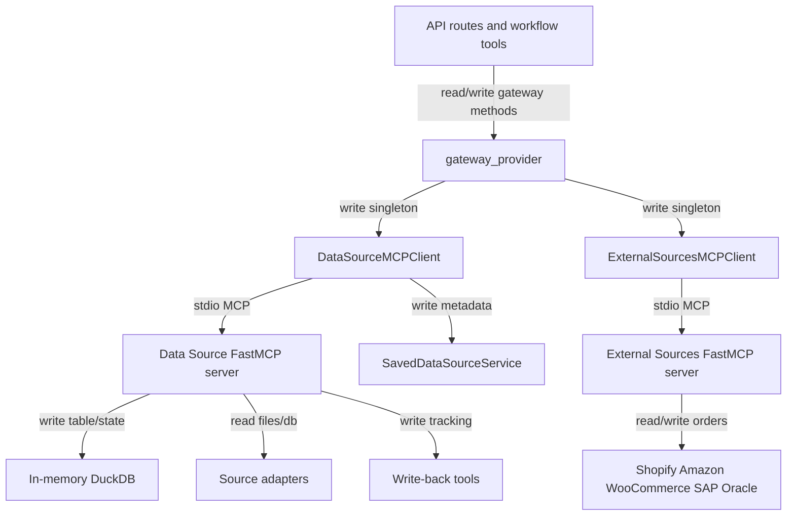

## Responsibility

The Data Source Gateways component owns deterministic order-data access and external platform integration. `src/services/gateway_provider.py` is the single owner of process-global data-source, external-source, and UPS gateway singletons, guarded by async locks. Data-source operations use `src/services/data_source_mcp_client.py`, which spawns `src.mcp.data_source.server` over stdio through `MCPClient` and exposes import, schema, query, row fetch, sample, commodity, lifecycle, and write-back methods.

`src/mcp/data_source/server.py` hosts a FastMCP server with one in-memory DuckDB connection and current-source state. It registers import/query/schema/checksum/write-back/sample/commodity tools and optional EDI support. Source-specific import logic lives under `src/mcp/data_source/adapters/`, while write-back logic lives in `src/mcp/data_source/tools/writeback_tools.py` and `src/services/write_back_utils.py`. External platform access uses `src/services/external_sources_mcp_client.py`, `src/mcp/external_sources/server.py`, `src/mcp/external_sources/tools.py`, and platform clients for Shopify, Amazon, WooCommerce, SAP, and Oracle.

Evidence: `tests/services/test_data_source_mcp_client.py`, `tests/services/test_gateway_provider.py`, `tests/mcp/data_source/test_import_file_router.py`, `tests/mcp/data_source/test_parameterized_query.py`, `tests/mcp/data_source/test_writeback_companion.py`, `tests/mcp/external_sources/test_tools.py`, and integration MCP tests.

## Read Variables

- File paths, delimiters, sheet names, header flags, format hints, record paths, database connection strings, database queries, and row-key columns.
- `SHIPAGENT_ALLOWED_PATHS`, `MCP_PYTHON_PATH`, project `.venv` Python path, current source metadata, type overrides, and mapping-cache fingerprints.
- SQL `where_sql`, positional `params`, `limit`, `offset`, active DuckDB schema, source row numbers, and checksums.
- Platform identifiers, credentials, store URLs, order filters, order IDs, tracking updates, and platform client connection state.
- Saved source metadata from the database when auto-saving imports or resolving session context.

## Write Variables

- DuckDB `imported_data` table, `current_source` metadata, `type_overrides`, flattened records, row checksums, inferred schema and import warnings.
- DataSourceMCPClient return DTOs: `DataSourceInfo`, `SchemaColumnInfo`, normalized rows with `_row_number` and `_checksum`, authoritative `total_count`, source signatures, and column samples.
- Saved data-source records for CSV, Excel, generic files, and database display metadata through `SavedDataSourceService`.
- Local write-back updates to CSV/Excel/delimited sources, companion CSV files for JSON/XML/EDI/fixed-width sources, database write-back updates, and external platform tracking updates.
- Gateway singleton references, reconnect state, mapping-cache invalidations, platform MCP connection state, client objects, and in-memory platform credentials.

## Conditional Loops

- Gateway accessors use async locks and reconnect if the cached MCP client is missing or disconnected.
- DataSourceMCPClient retries one time only for classified transport/session failures, then replays the MCP tool call after reconnect.
- Import routing chooses CSV, Excel, database, universal file, records, fixed-width, EDI, JSON, XML, or delimited adapters based on explicit arguments and file detection.
- File path validation enforces allowed roots and blocks sensitive filenames/directories before import or sniffing.
- Query tools validate parameterized WHERE expressions with SQL AST parsing, cap limits, cast selected columns by type override, and compute checksums for returned rows.
- Write-back branches by source type and iterates row updates independently; external source tools select the platform client and require an authenticated client before listing orders or updating tracking.

## Mermaid (internal flow)

