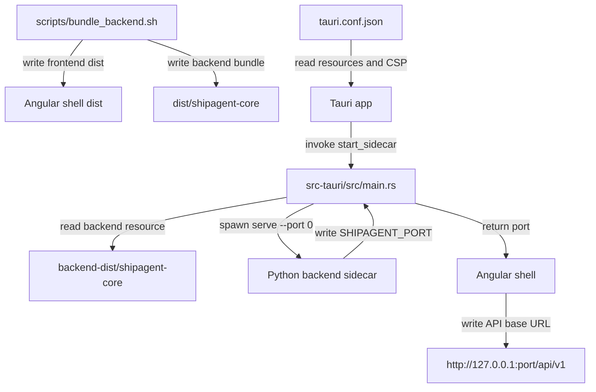

## Responsibility

The Desktop Sidecar Packaging component turns ShipAgent into a Tauri desktop app with a bundled Python backend. `src-tauri/src/main.rs` defines the Tauri v2 wrapper, initializes shell/updater plugins, and exposes the `start_sidecar` command. That command resolves the bundled `backend-dist/shipagent-core` resource, spawns it with `serve --port 0`, keeps the child process handle in managed state, reads stdout until `SHIPAGENT_PORT=...`, and returns the dynamic port to the Angular shell.

Packaging configuration is in `src-tauri/tauri.conf.json`, which points to the Angular shell build, declares app window/security settings, bundles `../dist/shipagent-core` as `backend-dist`, and targets macOS app/dmg bundles. `scripts/bundle_backend.sh` builds the frontend, runs PyInstaller using `shipagent-core.spec`, verifies the one-folder backend output, starts it on an OS-assigned port, and smoke-tests `/health`. `scripts/start-backend.sh` is the development backend launcher that loads `.env`, verifies `.venv` dependencies, and starts uvicorn with one worker.

Evidence: `tests/test_bundle_entry.py`, `tests/test_claude_sdk_optional.py`, `tests/utils/test_runtime.py`, and the build/packaging files under `src-tauri/` and `scripts/`.

## Read Variables

- Tauri resource directory, `backend-dist/shipagent-core` executable path, sidecar stdout/stderr command events, and `SIDECAR_TIMEOUT_SECS`.
- `src-tauri/tauri.conf.json` values: frontend dist, dev URL, CSP, window dimensions, bundle targets, icons, and resources.
- Frontend build output from `shipagent-frontend/dist/apps/shell/browser`, PyInstaller spec `shipagent-core.spec`, and backend binary path `dist/shipagent-core/shipagent-core`.
- Build-time updater public key placeholder checks, npm/Nx frontend dependencies, `.venv/bin/python`, and smoke-test `/health` endpoint.
- Development `.env`, `AGENT_MODEL`/`ANTHROPIC_MODEL`, `SHIPAGENT_PORT`, `.venv` presence, and runtime module import probes in `scripts/start-backend.sh`.

## Write Variables

- Tauri-managed `BackendProcess` child handle and returned sidecar port.
- Angular shell API base URL after frontend invokes `start_sidecar` through shared Tauri code.
- Packaged Tauri app/dmg artifacts, bundled backend resource directory, frontend production dist output, PyInstaller one-folder backend output, and temporary smoke stdout files.
- Development uvicorn process started by `scripts/start-backend.sh`.
- Error strings for missing backend binary, invalid resource path, backend startup failure, early sidecar termination, and sidecar timeout.

## Conditional Loops

- `start_sidecar` validates resource path existence and UTF-8 path conversion before spawning.
- The sidecar command event loop waits up to 30 seconds, branches on `Stdout`, `Error`, and `Terminated` events, parses `SHIPAGENT_ERROR=...` and `SHIPAGENT_PORT=...`, and returns timeout/error details on failure.
- Tauri config allows localhost dynamic ports in CSP because the backend binds to port `0`.
- Bundle script fails when updater key placeholder remains, then runs frontend build, PyInstaller build, binary verification, port discovery loop, `/health` smoke test, cleanup, and final output reporting.
- Development backend script branches on missing `.env`, legacy `ANTHROPIC_MODEL`, missing `.venv`, missing runtime dependencies, and default port/model values.

## Mermaid (internal flow)

