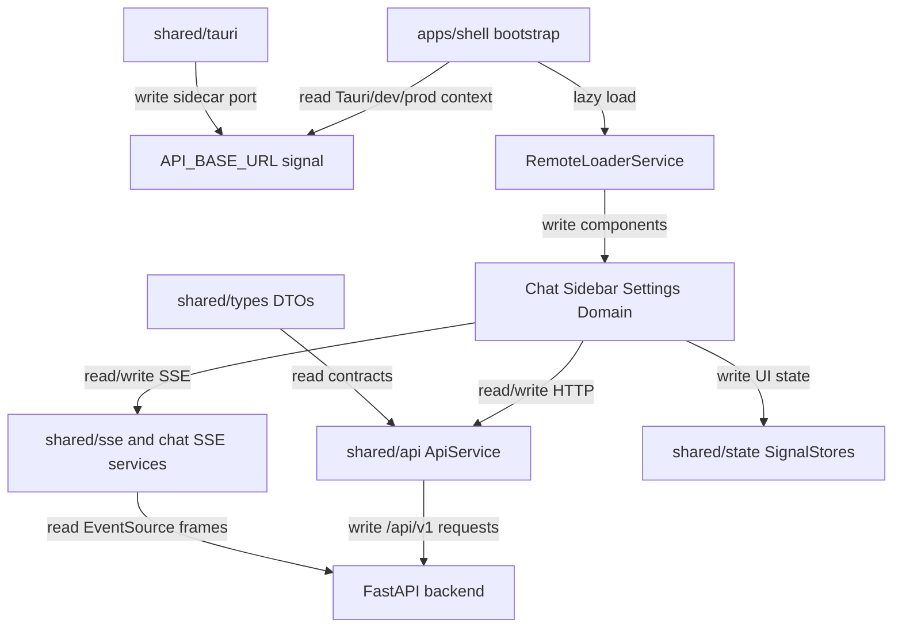

## Responsibility

The Frontend Workspace component is the active Angular/Nx application in `shipagent-frontend/`. The shell application (`apps/shell/`) owns bootstrap, root providers, API base URL setup, page frame, onboarding gate, update checker, and Native Federation remote loading through `RemoteLoaderService`. Remote applications own focused UI areas: `chat-remote` for conversation, SSE, previews, progress, commands, tokens, documents, and domain-card bridging; `sidebar-remote` for navigation/data-source/job adjacency; `settings-remote` for settings, provider credentials, onboarding, and platform setup; `domain-remote` for domain card registry and label preview; `provider-widget` for preview widget surfaces.

Shared libraries under `libs/shared/` are the frontend contracts: `shared/api` centralizes HttpClient calls to `/api/v1`, `shared/types` mirrors backend DTOs, `shared/state` provides NgRx SignalStores, `shared/sse` wraps EventSource lifecycle, `shared/tauri` resolves sidecar API ports, and `shared/ui` provides common pipes/directives/utilities. Native Federation configuration files in each app expose remote entries and share workspace libraries as singletons.

Evidence: `shipagent-frontend/apps/shell/src/app/remote-loader.service.ts`, `shipagent-frontend/libs/shared/api/src/api.service.ts`, `shipagent-frontend/libs/shared/sse/src/sse.service.ts`, `shipagent-frontend/libs/shared/tauri/src/port-resolver.ts`, `shipagent-frontend/libs/shared/state/src/*.ts`, and frontend spec files under `apps/*` and `libs/shared/state/src/*.spec.ts`.

## Read Variables

- API base URL signal from `API_BASE_URL`, resolved from Tauri sidecar port, localhost dev fallback, or relative production path.
- Backend DTO types from `libs/shared/types/src/`, route state, component inputs, uploaded `File` objects, browser `EventSource` messages, HTTP responses, and shared store state.
- Native Federation manifests and exposed module names such as `chat-remote` `./ChatContainer`, `sidebar-remote` `./SidebarContent`, `settings-remote` `./SettingsFlyout`, `settings-remote` `./OnboardingWizard`, and `domain-remote` `./DomainCardRegistry`.
- Tauri globals `window.__TAURI__` and `window.__SHIPAGENT_PORT__`, plus dynamic `@tauri-apps/api/core` import.
- User interaction state: conversation selection, message drafts, confirmation choices, upload forms, settings forms, provider/platform connection forms, and progress panels.

## Write Variables

- HttpClient requests for conversations, jobs, previews/confirmations, data-source uploads/imports, saved sources, platforms, connections, contacts, commands, settings, labels, and artifacts.
- `FormData` upload payloads for data sources and paperless documents.
- EventSource subscriptions and parsed events emitted into chat/progress services and stores.
- NgRx SignalStore state for app, conversations, jobs, data sources, settings, platforms, contacts, and commands.
- `window.__SHIPAGENT_PORT__` through the Tauri port resolver and remote component/service instances through `loadRemoteModule()`.
- UI state transitions: loading, error, stream connection, selected job/session/source, rendered artifacts, and confirmation controls.

## Conditional Loops

- Shell bootstrap branches between Tauri sidecar URL, localhost dev API URL, and relative production `/api/v1`.
- `resolveSidecarPort()` returns `null` outside Tauri, dynamically imports Tauri core inside Tauri, validates ephemeral port range, and writes the resolved port.
- `RemoteLoaderService` lazily loads remotes and falls back from `remoteEntry` exports to named component exports.
- `SseService` closes prior streams before connecting, skips ping/empty frames, parses backend `{event,data}` frames, updates Angular signals inside `NgZone`, and cleans up on unsubscribe/destroy.
- Native Federation config shares dependencies as singletons and skips test-only, Node-only, and CSS build packages; remote config keeps mapped workspace libraries shared to preserve DI singleton contracts.
- Stores and services branch on HTTP success/error/loading states and keep SSE handling outside the shared API service.

## Mermaid (internal flow)

