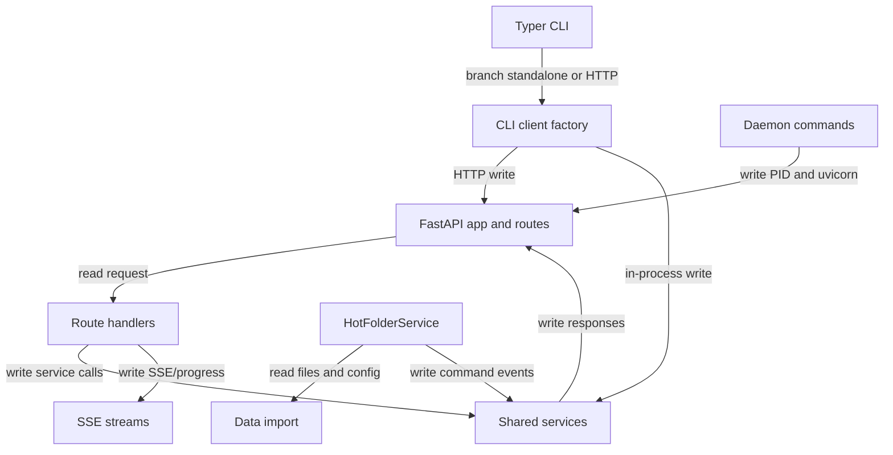

## Responsibility

The Interfaces and Automation component adapts external entry points into ShipAgent services. The primary HTTP entry point is `src/api/main.py`, which builds the FastAPI app, configures lifespan startup/shutdown, middleware, error handlers, static frontend serving, health/readiness endpoints, and includes route modules from `src/api/routes/*.py`. The route modules stay thin and call services such as `JobService`, `AuditService`, `ConversationPersistenceService`, `SettingsService`, `ConnectionService`, gateway providers, and shared execution functions.

The CLI entry point is `src/cli/main.py` via the `shipagent = "src.cli.main:app"` script in `pyproject.toml`. CLI commands choose an HTTP daemon client or in-process runner through `src/cli/factory.py`; daemon management lives in `src/cli/daemon.py`; reusable HTTP and in-process implementations are in `src/cli/http_client.py` and `src/cli/runner.py`. Hot-folder automation is wired from `src/api/main.py` into `src/cli/watchdog_service.py`, importing files and running conversation processing with optional auto-confirm rules.

Evidence: `tests/api/test_main_config.py`, `tests/api/test_auth_middleware.py`, `tests/api/test_security_headers.py`, `tests/api/test_conversations.py`, `tests/api/test_preview.py`, `tests/cli/test_main.py` equivalents under `tests/cli/`, and `tests/cli/test_watchdog_service.py`.

## Read Variables

- HTTP method, path, headers, body, upload files, route parameters, and query parameters consumed by `src/api/routes/*.py`.
- Environment/config values: `SHIPAGENT_API_KEY`, `ALLOWED_ORIGINS`, `SHIPAGENT_DISABLE_DOCS`, `SHIPAGENT_CONFIG_PATH`, `SHIPAGENT_ALLOW_MULTI_WORKER`, `CONVERSATION_TASK_QUEUE_MODE`, `SHIPAGENT_PORT`, and `.env` loaded by `scripts/start-backend.sh`.
- CLI globals and flags: `--standalone`, `--config`, job IDs, source paths, status filters, JSON output switches, daemon host/port/log-level values.
- Database sessions from `src/db/connection.py`, gateway accessors from `src/services/gateway_provider.py`, and health/readiness status from gateway and credential services.
- Watch-folder configuration from `src/cli/config.py`: folder paths, command text, file types, auto-confirm limits, and global auto-confirm defaults.

## Write Variables

- HTTP responses, SSE response frames, sanitized error responses, CORS/security headers, and static frontend responses.
- Service calls that create/update/delete jobs, sessions, contacts, commands, settings, provider connections, saved sources, uploads, labels, progress events, and audit records.
- Process-local background task sets for batch execution and conversation streaming cleanup in `src/api/routes/preview.py` and `src/api/routes/conversations.py`.
- CLI output through `src/cli/output.py`, HTTP requests through `src/cli/http_client.py`, direct DB/service changes through `src/cli/runner.py`, and daemon PID files in `src/cli/daemon.py`.
- Hot-folder `.processing`, `processed`, and `failed` file moves plus failure metadata written by `HotFolderService`.

## Conditional Loops

- `src/api/main.py` lifespan performs startup initialization, keyring/env loading, filter-secret creation, credential checks, single-worker warnings, startup recovery, watchdog backlog scanning, and graceful shutdown.
- API middleware branches on authentication, rate-limited paths, body-size exemptions, CORS allowlist, validation errors, and domain errors.
- Route handlers branch by resource state: missing jobs/sessions/sources, pending versus running jobs, preview hash presence, interactive versus batch mode, configured credentials, and file format.
- CLI factory branches between HTTP daemon mode and in-process standalone mode; daemon functions branch on stale/live PID files and health response.
- Watchdog loops debounce filesystem events, scan backlog files, claim files, serialize processing with one global lock, import CSV/Excel, stream agent events until preview, evaluate auto-confirm limits, and move files to processed or failed.

## Mermaid (internal flow)

