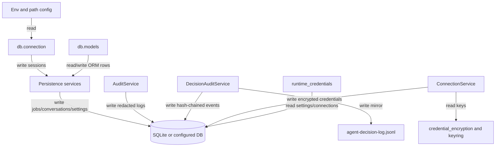

## Responsibility

The Persistence and Audit component owns durable application state and redaction-aware records. `src/db/connection.py` configures sync and async SQLAlchemy engines, SQLite pragmas, session factories, context managers, initialization, and startup migrations. `src/db/models.py` defines jobs, rows, audit logs, decision runs/events, write-back tasks, saved sources, contacts, encrypted provider connections, custom commands, conversations, settings, filter token consumption, and hosted tenant/account/artifact/confirmation records.

Service layers encapsulate table behavior: `JobService`, `AuditService`, `DecisionAuditService`, `ConversationPersistenceService`, `ConnectionService`, `SettingsService`, `ContactService`, `CustomCommandService`, `SavedDataSourceService`, `credential_encryption.py`, `keyring_store.py`, `runtime_credentials.py`, and `write_back_worker.py`. The component also mirrors decision audit events to JSONL and redacts PII/credentials before storing or exporting logs.

Evidence: `tests/db/test_connection_config.py`, `tests/db/test_conversation_models.py`, `tests/db/test_provider_connection_model.py`, `tests/services/test_decision_audit_service.py`, `tests/services/test_conversation_persistence_service.py`, `tests/services/test_connection_service.py`, `tests/services/test_settings_service.py`, `tests/services/test_contact_service.py`, `tests/api/test_agent_audit.py`, and `tests/utils/test_redaction.py`.

## Read Variables

- Database configuration: `DATABASE_URL`, `SHIPAGENT_DB_PATH`, `SQL_ECHO`, SQLite path defaults, async database URL derivation, and SQLAlchemy connection state.
- ORM rows and request/service inputs for jobs, job rows, audit logs, provider connections, settings, contacts, commands, saved sources, conversations, messages, write-back tasks, and hosted records.
- Encryption key material from env, configured key files, platformdirs fallback, and keyring values loaded into env at startup.
- Audit inputs: raw user messages, structured payloads, event phases, actors, tool names, latency, query filters, retention days, max payload bytes, and JSONL path.
- Settings and provider connection state consumed by runtime credential resolution.

## Write Variables

- Database rows in all ORM tables plus schema migrations/backfills for provider connections, conversation tables, settings, hosted records, in-flight rows, write-back tasks, and other incremental columns.
- AuditLog rows with redacted JSON details, DecisionAuditRun/Event rows with hashes and redacted payloads, and JSONL mirror entries.
- Encrypted provider credential envelopes with AAD binding, provider connection statuses, sanitized connection errors, metadata JSON, and runtime credential DTOs.
- AppSettings singleton, contact records, custom command records, saved source metadata, conversation sessions/messages, message metadata, soft-delete flags, and write-back retry/dead-letter statuses.
- SQLite pragmas, committed/rolled-back session transactions, and database engine/session resources.

## Conditional Loops

- Database URL resolution prefers `DATABASE_URL`, then `SHIPAGENT_DB_PATH`, then platform default SQLite.
- SQLite connections enable foreign keys, WAL, and synchronous mode; session context managers commit on success and roll back on exceptions.
- Startup migration functions inspect table columns and indexes, add missing columns, backfill defaults, and harden unique constraints idempotently.
- Redaction recursively traverses dict/list/string payloads with depth limits and pattern replacements for emails, phones, tokens, address/customer fields, and credentials.
- Settings updates reject unknown mutable fields and keep onboarding changes behind a dedicated method.
- ConnectionService validates provider/auth/environment/credential keys, normalizes domains, encrypts with AAD, handles integrity conflicts, and stores sanitized errors.
- DecisionAuditService rate-limits retention cleanup, truncates oversized payloads, computes previous/current event hashes, and writes JSONL mirror entries asynchronously.

## Mermaid (internal flow)

