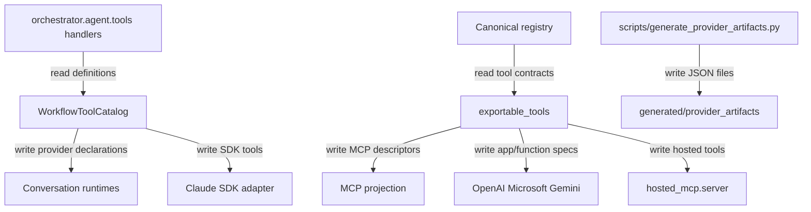

## Responsibility

The Workflow Tool Registry component owns the model-visible and provider-exported tool backbone. `src/orchestrator/agent/tools/__init__.py` imports concrete tool handlers from `contacts.py`, `data.py`, `documents.py`, `interactive.py`, `pickup.py`, `pipeline.py`, `tracking.py`, and `ups.py`, then returns `ToolDefinition` dictionaries used by both the Claude SDK adapter and the provider-neutral runtime. `src/services/conversation_runtime/tool_catalog.py` wraps those definitions into `WorkflowToolDefinition` objects with mode, side-effect, confirmation, result projection, artifact event, timeout, retry, and parallel-read metadata.

The canonical hosted/provider contract lives in `src/registry/`: Pydantic `ToolContract` and `RegistrySchema` models, public/private tool catalogs, and JSON export helpers. `src/provider_adapters/` projects registry contracts to MCP, OpenAI app tools, Microsoft OpenAPI operations, and Gemini function declarations. `scripts/generate_provider_artifacts.py` writes checked-in provider artifacts under `generated/provider_artifacts/`. `src/hosted_mcp/server.py` binds registry tools with supplied handlers into a FastMCP hosted server.

Evidence: `tests/services/conversation_runtime/test_tool_catalog.py`, `tests/orchestrator/agent/test_tool_definitions_filter.py`, `tests/registry/test_catalog.py`, `tests/registry/test_models.py`, `tests/registry/test_artifact_drift.py`, `tests/provider_adapters/test_projections.py`, and `tests/hosted/test_hosted_mcp_registry.py`.

## Read Variables

- Tool handler definitions from `src/orchestrator/agent/tools/*`, including names, descriptions, input schemas, handlers, and event bridges.
- Conversation mode (`interactive_shipping`) and event bridge callbacks passed into `WorkflowToolCatalog.for_mode()`.
- Side-effect classification sets in `tool_catalog.py`: batch-only, interactive-only, read-only, artifact events, confirmation-required, state-changing, money-changing, and parallel-read-only tool names.
- Canonical `ToolContract` values: visibility, availability, side effects, confirmation policy, auth scopes, provider exports, audit level, result sensitivity, input/output schemas, and UI resource URIs.
- Provider export targets and handler mappings for hosted MCP binding.

## Write Variables

- Runtime `WorkflowToolDefinition` instances and `ProviderToolDeclaration` objects consumed by neutral providers.
- Claude SDK `SdkMcpTool` objects and in-process orchestrator MCP server registrations.
- Provider artifacts: `registry.json`, `generic_mcp_tools.json`, `openai_apps_tools.json`, `microsoft_openapi_operations.json`, and `gemini_functions.json`.
- Hosted FastMCP `BoundRegistryTool` instances with structured content and JSON text results.
- Provider-specific descriptor fields such as MCP annotations, OpenAI `_meta.ui.resourceUri`, Gemini parameter objects, and Microsoft OpenAPI operations.

## Conditional Loops

- Tool exposure branches on interactive versus batch mode, with batch-only tools such as `ship_command_pipeline` and interactive-only tools such as `preview_interactive_shipment`.
- `_side_effect_for()` requires explicit side-effect metadata for every workflow tool; missing metadata raises.
- Provider export filtering includes only tools enabled for the requested `ProviderExport` and, for public exports, registry validators enforce implementation, tenant safety, hosted readiness, and confirmation for side-effecting tools.
- Projection logic branches on side-effect classes to set read-only/destructive/open-world hints and attaches UI metadata only when a tool declares a UI resource.
- Artifact generation iterates every export target and writes stable sorted JSON; drift tests compare generated output to checked-in artifacts.

## Mermaid (internal flow)

